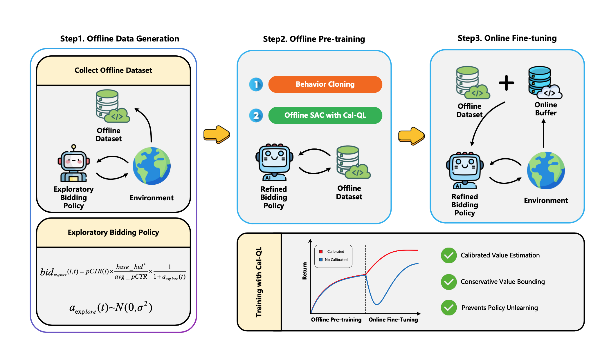

# XCalBid: Robust and Efficient Real-Time Bidding via Exploratory Pre-training and Calibrated Q-Learning

This repository provides the official PyTorch implementation of the following paper: 
> [**XCalBid: Robust and Efficient Real-Time Bidding via Exploratory Pre-training and Calibrated Q-Learning**]() <br>
> Authors of the paper  
> Affiliation withheld for anonymity

## 🌟 Overview



---

## 📦 Dependencies and Initial Setup

This project is built upon the [hzn666/RLBid_EA](https://github.com/hzn666/RLBid_EA) codebase. Before running this repository, please ensure that you have completed the following setup steps:

### ✅ Step 1: Clone the Base Repository

```bash
git clone https://github.com/hzn666/RLBid_EA.git
```

### ✅ Step 2: Run Required Sections in RLBid_EA

Before proceeding, run the following sections of the original repository to prepare data and models:

- Data
- CTR Prediction
- Bidding Strategy (LIN)

Please follow the instructions in the original repository's documentation to execute these sections.

### ✅ Step 3: Place This Repository in the Correct Path

After completing the above setup, copy or clone this repository into the specified location within the `RLBid_EA` directory structure:

```
RLBid_EA/
├── data/                         # Data section outputs
├── lin/                          # LIN bidding strategy files
│   └── ... 
└── XCalBid/                      # Place this repository here
    ├── run.sh                    # Execution script
    └── ...                       # Other source files
```

## 🔧 Installation

We recommend using a Conda environment for dependency management:
```bash
conda create -n rlbid python=3.10.15
conda activate rlbid
conda install pytorch pytorch-cuda=11.8 -c pytorch -c nvidia
conda install -c "nvidia/label/cuda-11.8.0" cuda-toolkit
pip install -r requirements.txt
```

## 📚 Augument offline data

To generate augmented offline data, run the following script:
```bash
bash collect-offline-data.sh
```

## ⏩ Train and Evaluate the Model

To train and test the XCalBid model, simply run:

```bash
bash run.sh
```

This script will execute the full training and evaluation pipeline as described in the paper.
